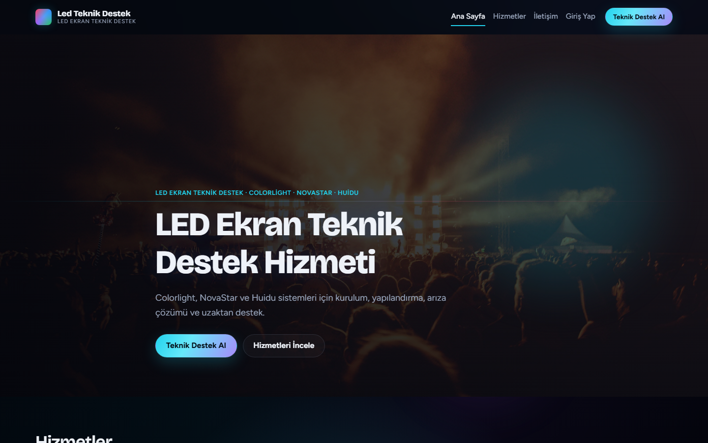
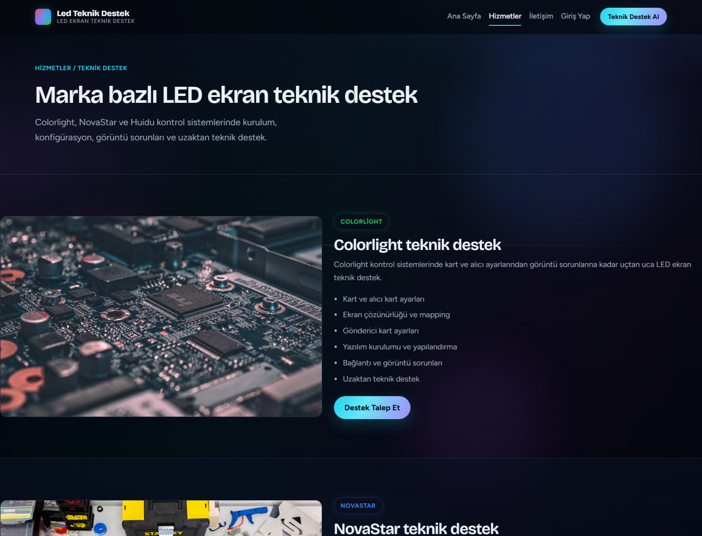
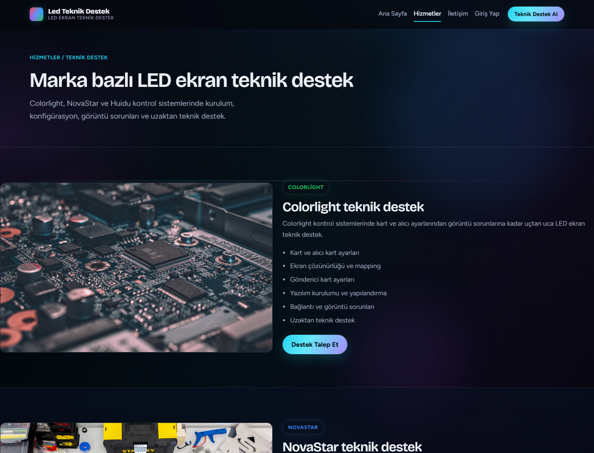
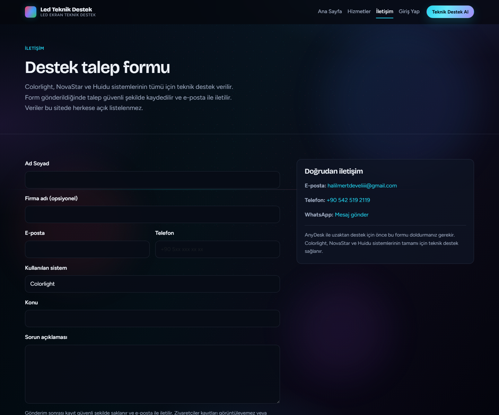
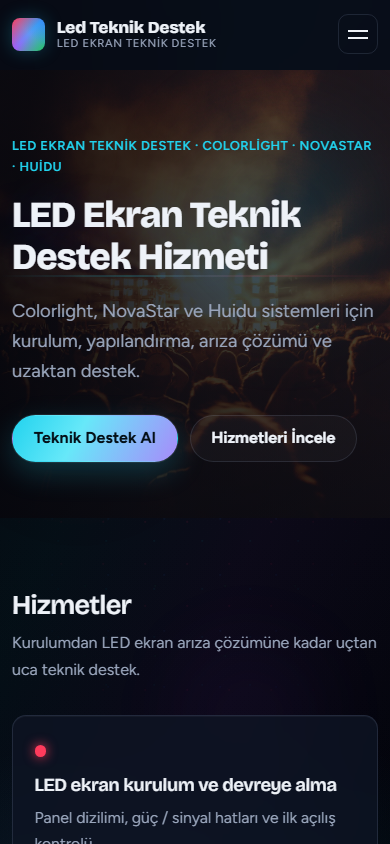
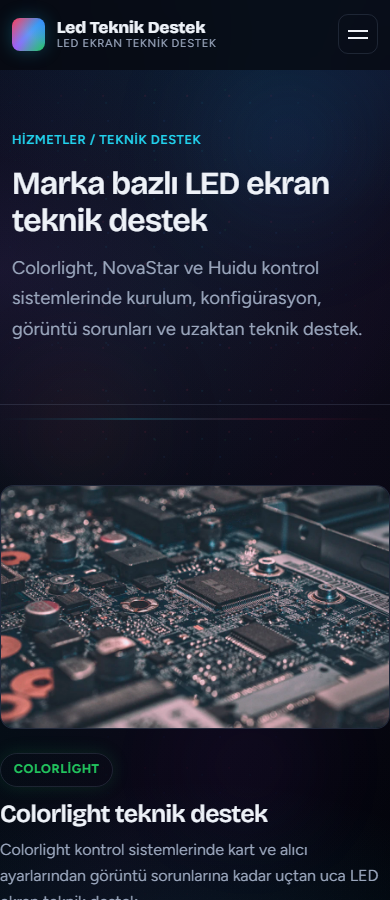
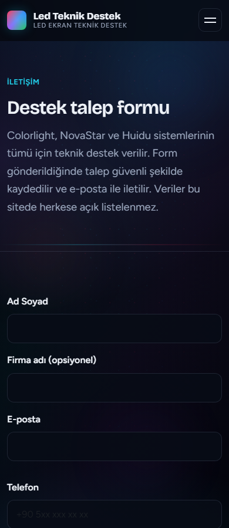

# LED Teknik Destek

Colorlight, NovaStar ve Huidu LED ekran kontrol sistemleri için teknik destek, AnyDesk ile uzaktan yardım ve güvenli destek talep formu sunan **production-ready** ASP.NET Core web uygulaması.



---

## 🌐 Live Demo

| Ortam | Adres |
|:------|:------|
| **Production (LED uygulaması)** | [https://asp-net-app-for-led.vercel.app](https://asp-net-app-for-led.vercel.app) |

> Not: `halilmertdeveli.com.tr` şu an ayrı bir kişisel portföy sitesine yönlenir. Bu repository’deki LED Teknik Destek uygulamasının canlı adresi yukarıdaki Vercel production URL’sidir. Domain / DNS ayarlarına bu dokümantasyon görevinde dokunulmamıştır.

---

## 📸 Screenshots

### Desktop

#### Ana sayfa

Hero, marka vurgusu ve hizmetlere giriş.


#### Hizmetler

Kurulum, arıza çözümü ve uzaktan destek hizmetleri.



#### Destek / ürünler

Kontrol sistemleri ve destek içerikleri.



#### İletişim formu

Supabase + Resend ile çalışan destek talep formu.



### Mobile

#### Mobil ana sayfa



#### Mobil hizmetler



#### Mobil iletişim



---

## 🚀 Proje Hakkında

LED ekran operatörleri ve sahadaki ekipler için hızlı teknik destek hattı sağlar:

- Colorlight / NovaStar / Huidu odaklı içerik
- AnyDesk ile uzaktan bağlantı yönlendirmesi
- Müşteri destek formu → veritabanı kaydı → e-posta bildirimi
- Google ile müşteri hesabı ve talep sohbeti (Supabase Auth + Realtime)
- Yönetici paneli ile talepleri takip

---

## ✨ Özellikler

- Responsive, modern koyu tema arayüz
- LED kontrol sistemleri (Colorlight, NovaStar, Huidu) odaklı içerik
- AnyDesk uzaktan destek yönlendirmesi
- Destek talep formu (doğrulama + rate limit)
- Supabase PostgreSQL’e talep kaydı (`support_messages`)
- Resend ile operatör e-postası (`Reply-To` = müşteri e-postası)
- Mail başarısız olsa bile talebin veritabanında kalması (`email_status`)
- Google ile giriş (Supabase Auth)
- Müşteri hesap / talep sohbeti (Realtime)
- Admin paneli (talepler, müşteriler, konuşmalar)
- SEO: meta etiketleri, Open Graph, `robots.txt`, `sitemap.xml`
- HTTPS production (Vercel)
- Secret’lar environment variable / user-secrets ile yönetilir

---

## 🛠️ Teknolojiler

| Katman | Teknoloji |
|:-------|:----------|
| Backend / UI | ASP.NET Core 8, Razor Pages, C# |
| Stil / istemci | HTML, CSS, JavaScript |
| Veri / Auth | Supabase (PostgreSQL, Auth, Realtime) |
| E-posta | Resend |
| Hosting | Vercel (Container Runtime) |

---

## 🏗️ Proje Yapısı

```text
ASP.NET-APP-FOR-LED/
├── README.md
├── LedSupport.sln
├── Dockerfile.vercel
├── vercel.json
├── .env.example
├── docs/
│   ├── screenshots/          # README görselleri
│   └── supabase/             # SQL şema / RPC
├── scripts/                  # Yerel secret yardımcıları
├── src/
│   └── LedSupport.Web/       # Ana uygulama
│       ├── Pages/            # Razor Pages (Index, Services, Contact, Admin…)
│       ├── Services/         # Supabase, Resend, destek formu
│       ├── Options/          # Ayar modelleri
│       ├── Api/              # Destek API uçları
│       └── wwwroot/          # css, js, images, robots, sitemap
└── legacy/                   # Eski referans kod (aktif runtime değil)
```

---

## ⚙️ Kurulum

### Gereksinimler

- [.NET 8 SDK](https://dotnet.microsoft.com/download/dotnet/8.0)
- (İsteğe bağlı) Supabase projesi + Resend hesabı

### Adımlar

```bash
git clone https://github.com/HalilMertDeveli/ASP.NET-APP-FOR-LED.git
cd ASP.NET-APP-FOR-LED

dotnet restore src/LedSupport.Web/LedSupport.Web.csproj
dotnet build src/LedSupport.Web/LedSupport.Web.csproj
dotnet run --project src/LedSupport.Web --launch-profile http
```

Yerel adres: **http://localhost:5052**

---

## 🔐 Environment Variables / Configuration

Gerçek secret değerleri repoya **yazılmaz**. Şablon: [`.env.example`](.env.example)

Yerelde `dotnet user-secrets` veya ortam değişkeni kullanın. Production’da Vercel Environment Variables kullanın.

| Değişken | Açıklama |
|:---------|:--------|
| `SUPABASE_URL` / `Supabase__Url` | Supabase proje URL |
| `SUPABASE_ANON_KEY` / `Supabase__PublishableKey` | Publishable (anon) key |
| `SUPABASE_SERVICE_ROLE_KEY` | Yalnızca sunucu (asla browser’a verme) |
| `RESEND_API_KEY` / `Resend__ApiKey` | Resend API anahtarı |
| `Resend__FromEmail` | Doğrulanmış gönderici |
| `SUPPORT_EMAIL` / `Resend__ToEmail` | Operatör alıcı e-posta |
| `Support__IngestSecret` | (Opsiyonel) ingest RPC secret |

PowerShell yardımcısı:

```powershell
cd scripts
powershell -ExecutionPolicy Bypass -File .\configure-support-secrets.ps1
```

Supabase şema / RPC SQL dosyaları: [`docs/supabase/`](docs/supabase/)

---

## 🌍 Deployment

- Platform: **Vercel** (container / `Dockerfile.vercel`)
- Production: [asp-net-app-for-led.vercel.app](https://asp-net-app-for-led.vercel.app)
- GitHub `master` branch push → otomatik production deploy
- Secret’lar Vercel Production Environment Variables üzerinden okunur

---

## 📱 Responsive Design

Arayüz masaüstü ve mobil için tasarlanmıştır. Yukarıdaki **Desktop** ve **Mobile** ekran görüntüleri canlı production üzerinden alınmıştır.

---

## 📈 SEO

Uygulamada mevcut:

- Sayfa meta description / title
- Open Graph / Twitter meta alanları
- [`wwwroot/robots.txt`](src/LedSupport.Web/wwwroot/robots.txt)
- [`wwwroot/sitemap.xml`](src/LedSupport.Web/wwwroot/sitemap.xml)

---

## 🔒 Security

- HTTPS (production)
- Secret’lar env / user-secrets; Git’e commit edilmez (`.gitignore`)
- Form input validation + rate limiting
- Cookie authentication (müşteri / admin)
- Supabase RLS + sunucu tarafı service role / ingest RPC
- API anahtarları frontend JavaScript’e gömülmez

---

## 📬 Contact

Sitedeki iletişim kanalları (genel iletişim bilgisi):

- Destek formu: [/Contact](https://asp-net-app-for-led.vercel.app/Contact)
- E-posta / telefon / WhatsApp: form sayfasındaki “Doğrudan iletişim” alanı

SMTP şifresi veya API key gibi gizli yapılandırmalar burada paylaşılmaz.

---

## 👨‍💻 Developer

**Halil Mert Develi**

- GitHub: [HalilMertDeveli](https://github.com/HalilMertDeveli)
- Repository: [ASP.NET-APP-FOR-LED](https://github.com/HalilMertDeveli/ASP.NET-APP-FOR-LED)

---

## 📄 License

Repository’de ayrı bir `LICENSE` dosyası bulunmuyor. Kullanım özel / ticari proje kapsamındadır.
