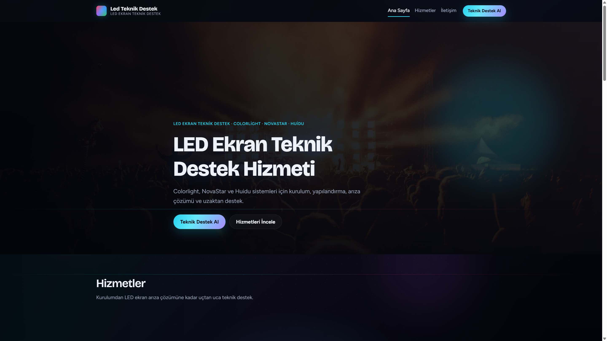
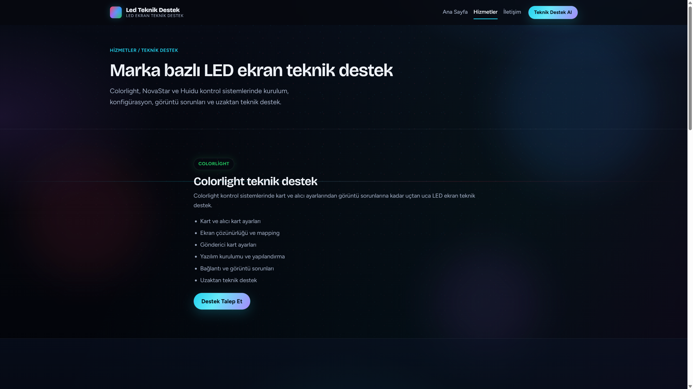
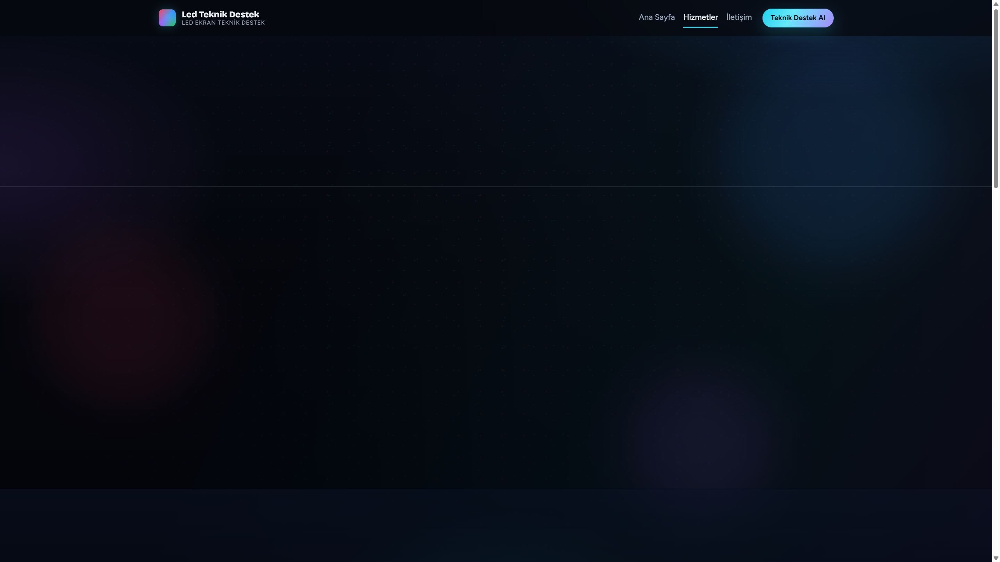

# LED Teknik Destek

Colorlight, NovaStar ve Huidu LED ekran kontrol sistemleri için teknik destek, AnyDesk ile uzaktan bağlantı ve destek talep formu sunan modern web sitesi.

<p align="center">
  
</p>

<p align="center"><b>Ana sayfa</b> — LED hero, hizmetler ve marka odaklı giriş</p>

---

## Site önizleme

### Ana sayfa


Koyu LED/neon arayüz, Colorlight · NovaStar · Huidu vurgusu, teknik destek CTA’ları.

### Hizmetler



Colorlight, NovaStar ve Huidu için ayrı destek alanları, SSS ve talep butonları.

### İletişim / Destek formu



Ad soyad, sistem seçimi, konu ve sorun açıklaması; Firestore + e-posta bildirimi.

---

## Özellikler

| | |
|:--|:--|
| **Tasarım** | Responsive LED/neon arayüz |
| **Markalar** | Colorlight, NovaStar ve Huidu desteği |
| **Uzaktan** | AnyDesk ile uzaktan teknik destek |
| **Kayıt** | Firebase Firestore ile destek talebi |
| **E-posta** | Firebase Functions + Resend bildirimi |
| **SEO** | ASP.NET Core Razor Pages, meta / sitemap |

## Teknolojiler

- ASP.NET Core 8 Razor Pages  
- Firebase Firestore  
- Firebase Cloud Functions  
- Resend  
- HTML, CSS ve JavaScript  

## Yerel çalıştırma

```bash
dotnet restore src/LedSupport.Web/LedSupport.Web.csproj
dotnet run --project src/LedSupport.Web --launch-profile http
```

Adres: **http://localhost:5052**

## Firebase / e-posta

Kurulum adımları: **[docs/FIREBASE_SUPPORT_SETUP.md](docs/FIREBASE_SUPPORT_SETUP.md)**

```powershell
cd scripts
powershell -ExecutionPolicy Bypass -File .\configure-support-secrets.ps1
```

## Proje yapısı

```text
src/LedSupport.Web/     # Razor Pages + wwwroot/images (WebP)
functions/              # Cloud Functions + Resend
docs/screenshots/       # README site görselleri
legacy/                 # Eski MVC referans kodu
```

## Güvenlik

Gerçek API anahtarları, Firebase secret’ları ve servis hesabı dosyaları repoya **eklenmez**. Yalnızca `.env.example` ve placeholder örnekleri commit edilir.

## Lisans

Özel / ticari kullanım — ekip içi proje.
